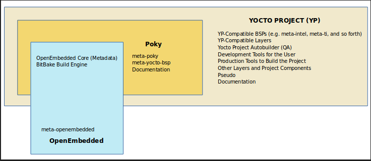
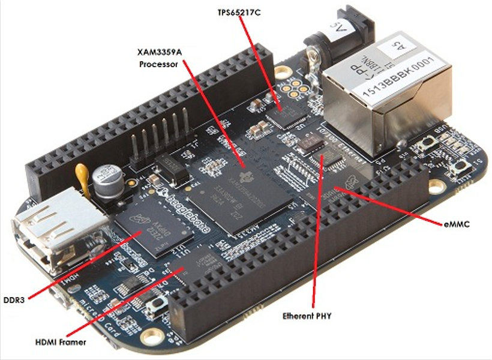

# Yocto project
### Concept
#### Four elements of embedded linux
- Toolchain: The compiler and another tools needed to create code for your target device. Everything else depends on the toolchain          
- Bootloader: The program that initializes the board and loads the linux kernel         
- Kernel: This is the heart of the system, managing system resources and interfacing with hardware          
- Root filesystem: Contain the libraries and programs that are once the kernel has completed its initialization         

#### Yocto
Yocto is project open source, high quality infrastructure and tools to help developers create their own custom linux distributions for any hardware architecture.           
To uderstand the outcome provided by the Yocto project, We can use the analogy of computing machine             
Input: set of data that describes what we want, that's our specification (kernel configuration, hardware name, package/binaries to be installed)            
Output: Linux Based Embedded Product (Linux kernel, Root filesystem, Bootloader, Device tree, Toolchain)           

#### Setting up build machine
Prerequisites           
1. 50 Gbytes of free disk space         
2. Runs a supported Linux distribution (i.e. recent releases of Fedora, openSUSE, CentOS, Debian, or Ubuntu).               
3.              
	Git 1.8.3.1 or greater          
	tar 1.27 or greater         
	Python 3.4.0 or greater.            
4. Install the required packages for Yocto to Work from https://www.yoctoproject.org/docs/latest/ref-manual/ref-manual.html#ubuntu-packages             
```
sudo apt-get install gawk wget git-core diffstat unzip texinfo gcc-multilib \
    build-essential chrpath socat cpio python python3 python3-pip python3-pexpect \
    xz-utils debianutils iputils-ping python3-git python3-jinja2 libegl1-mesa libsdl1.2-dev \
    pylint3 xterm
```
#### Poky
Poky is a reference distribution of Yocto Project. The word "reference" is used to mean "example" in this context.          
Yocto Project uses Poky to build images (kernel, system, and application software) for targeted hardware                
At the technical level it is a combined repository of the components:           
+ Bitbake       
+ OpenEmbedded Core       
+ meta-yocto-bsp       
+ Documentation       
Note: Poky does not contain binary files,it is a working example of how to build your own custom Linux distribution from source.        
What is difference between poky and Yocto: The exact difference between Yocto and Poky is Yocto refers to the organization          

#### Metadata
Non Yocto:  A set of data that describes and gives information about other data         
Yocto World:                
	Metadata refers to the build instructions           
	Commands and data used to indicate what versions of software are used           
	Where they are obtained from        
	Changes or additions to the software itself (patches) which are used to fix bugs or customize the software for use in a particular situation                

Metadata is collection of           
	• Recipes (.bb and .bbappend)       
	• Configuration files (.conf)           
	• Classes (.bbclass)        
	• Includes (.inc)           

##### Recipes
- Non-Yocto: A recipe is a set of instructions that describe how to prepare or make something, especically a dish           
- Yocto: A recipe is a set of instructions that is read and processed by the bitbake            
Extention of recipe: .bb            
A recipe describes:
    + where you get the source
    + which patches to apply
    + configuration options
    + compile options (library dependencies)
    + Install
    + License
Ex: dhcp.4.4.bb

##### Configuration files
File which hold:        
    + global definition of variables            
    + user defined variables and hardware configuration information         
They tell the build system what to build and put into the image to support a particular platform            
Types:      
    + Machine configuration options         
    + Distribution configuration options            
    + Compiler tuning options           
    + General common configuration options          
    + User configuration options (local.conf)           

##### Classes
Class files are used to abstract common functionality and share it amongst multiple recipe (.bb) files.     
To use a class file, you simply make sure the recipe inherits the class     
Eg. inherit classname
Extention: .bbclass
They are usually placed in classes directory inside the meta* directory     
Ex: cmake.bbclass (handle cmake in recipes)         
    kernel.bbclass (handle building kernels. Contains code to build all kernel tress)
    module.bbclass (provides support for building out-of-tree linux kernel modules)

##### Layers
A collection of related recipes or layers recipe containers (folder)        
Typecal naming convention: meta-<layername>             
Poky has the following layers: meta, meta-poky, meta-selftest, meta-yocto-bsp
Layers provide a mechanism to isolate meta data according to functionality, for instance BSPs, distribution configuration, etc.         
Which layers are used by Poky build system?     
BBLAYERS variable present in build/conf/bblayers.conf file list the layers Bitbake tries to find. If bblayers.conf not present when you start the build, the OpenEmbedded build system creates it from bblayers.conf.sample when you source the oe-init-build-env script.           
Command to find out which layers are present:           
```
bitbake-layers show-layers
bitbake-layers show-dependencies
bitbake-layers show-recipes

```
Where to get other layers
```
https://layers.openembedded.org/layerindex/branch/master/layers
```
Yocto project compatible layers
```
https://www.yoctoproject.org/software-overview/layers
```
these layers are tested and are fully compatible with yocto project.            
Openembedded layer index contains more layers but the content is less universally validated

##### Image
An image is the top level recipe, it has a description, a license and inherits the core-image class. It is used alongside the machine definition, machine describes the hardware used and its capabilities. Image is architecture agnostic and defines how the root filesystem is built, with what packages. By default, several images are provided in Poky.
Command to check the list of available image recipes:
```
cd poky
ls meta*/recipes*/images/*.bb
```

##### Packages
Non-Yocto: any wrapped or boxed object or group of objects.     
Yocto: a package is a binary file with name *.rpm, *.deb, or *.ipkg
A single recipe produces many packages. All packages that a recipe generated are listed in the recipe variable
```
cd poky
vi meta/recipes-multimedia/libtiff/tiff_4.0.10.bb (PACKAGE =+ "tiffxx tiff-utils")
```

#### Bitbake
Bitbake is a core component of the Yocto Project. It basically performs the same functionality as of make. It's a task scheduler that parses python and shell script mixed code         
The code parsed generates and runs tasks, which are basically a set of steps ordered according to code's dependencies.              
It reads recipes and follows them by fetching packages, building them and incorporating the results into bootable images.               
It keeps track of all tasks being processed in order to ensure completion, maximizing the use of processing resources to reduce build time and being predictable.           

#### Meta-yocto-bsp
A Board Support Package (BSP) is a collection of information that defines how to support a particular hardware device, set of devices, or hardware platform         
The BSP includes information about the hardware features present on the device and kernel configuration information along with any additional hardware drivers required.        
The BSP also lists any additional software components required in addition to a generic Linux software stack for both essential and optional platform features.         
The meta-yocto-bsp layer in Poky maintains several BSPs such as the Beaglebone, EdgeRouter, and generic versions of both 32-bit and 64-bit IA machines.         

Machines supported:         
Texas Instruments BeagleBone (beaglebone)           
Freescale MPC8315E-RDB (mpc8315e-rdb)           
Intel x86-based PCs and devices (genericx86 and genericx86-64)          
Ubiquiti Networks EdgeRouter Lite (edgerouter)          

Note: To develop on different hardware, you will need to complement Poky with hardware-specific Yocto layers.           
conf/machine/*.conf list all the hardware devices supported by the BSP layer                        

#### Poky referency distribution
meta-poky, which is Poky-specific metadata          
Documentation, which contains the Yocto Project source files used to make the set of user manuals.          
Poky includes:              
	some OE components(oe-core)
	bitbake
	demo-BSP's
	helper scripts to setup environment
	emulator QEMU to test the image


#### Workflow of Yocto Project
Step 1: Download the Poky Source code           
```
mkdir yocto_project
cd yocto_project
git clone git://git.yoctoproject.org/poky
```
Step 2: Checkout the latest branch/release (zeus)           
```
cd poky
git checkout zeus
```
Step 3: Prepare the build environment           
Poky provides you a script 'oe-init-build-env', which should be used to setup the build environment. The script will set up your environment to use Yocto build system,including adding the BitBake utility to your path            
```
source poky/oe-init-build-env [ build_directory ]
Ex:source oe-init-build-env ../build
```
Here build_directory is an optional argument for the name of the directory where the environment is set in case it is not given , it defaults to "build"        
The above script will move you in a build folder and create two files ( local.conf, bblayers.conf ) inside conf folder          
Step 4: Building Linux Distribution         
```
bitbake <image_name>
time bitbake core-image-minimal
```
This is a small image allowing a device to boot, and it is very useful for kernel and boot loader tests and development

#### Command to run the generated image in QEMU
Quick Emulator (QEMU) is a free and open source software package that performs hardware virtualization.         
The QEMU based machines allow test and development without real hardware.               
Currently emulations are supported for:             
+ ARM           
+ MIPS          
+ MIPS64            
+ PowerPC           
+ X86               
+ X86_64            
Poky provides a script 'runqemu' which will allow you to start the QEMU using yocto generated images.       
```
nproc
free -m
runqemu <machine> <zimage> <filesystem>
where:
   <machine> is the machine/architecture to use (qemuarm/qemumips/qemuppc/qemux86/qemux86-64)
   <zimage> is the path to a kernel (e.g. zimage-qemuarm.bin)
   <filesystem> is the path to an ext2 image (e.g. filesystem-qemuarm.ext2) or an nfs directory

Ex: runqemu qemux86_64 core-image-minimal
df -h
cat /proc/cpuinfo
uname -a
ipconfig
poweroff
```
Full usage instructions can be seen by running the command with no options specified.           
Exit QEMU by either clicking on the shutdown icon or by typing Ctrl-C in the QEMU transcript window from which you evoked QEMU.             

#### Steps to generate ARM image and run in QEMU
When you set up the build environment, a local configuration file named local.conf becomes available in a conf subdirectory of the Build Directory. The defaults are set to build for a qemux86-64 target           
Edit ./build/conf/local.conf
Set
MACHINE = "qemuarm"
```
source poky/oe-init-build-env (can be skip if done before)
bitbake core-image-minimal (can be skip if done before)
runqemu core-image-minimal (after set MACHINE = "qemuarm" have to run this step)
df -h
cat /proc/cpuinfo
uname -a
ipconfig
poweroff
```

#### Run QEMU without graphic
You can launch QEMU without the graphic window by adding nographic to the command line
```
runqemu qemuarm nographic
```

#### To add a particular package in your root file system
Open your local.conf file and add the recipe name below             
```
IMAGE_INSTALL += "recipe-name"          
E.g. IMAGE_INSTALL += "usbutils" (for lsusb)            
or IMAGE_INSTALL_append = " usbutils"          (bester) 
bitbake core-image-minimal
bitbake -e core-image-minimal | grep ^IMAGE_INSTALL=
runqemu core-image-minimal nographic
lsusb (make sure it work properly)
```

#### Build and run core-image-sato
This is the X11 Window-system-based image with a SATO theme and a GNOME mobile desktop environment
```
bitbake core-image-sato
runqemu qemuarm core-image-sato
```

#### Poky source tree
```
bitbake		-	Holds all Python scripts used by the bitbake command
			bitbake/bin is placed into the PATH environmental variable so bitbake can be found

documentation   -       All documentation sources for the Yocto Project documentation
			Can be used to generate nice PDFs

meta		-	Contains the oe-core metadata
			
meta-poky	-	Holds the configuration for the Poky reference distribution
			local.conf.sample, bblayers.conf.sample are present here

meta-skeleton	- 	Contains template recipes for BSP and kernel development


meta-yocto-bsp  -	Maintains several BSPs such as the Beaglebone, EdgeRouter, 
			and generic versions of both 32-bit and 64-bit IA machines.

scripts		-	Contains scripts used to set up the environment, development tools,
			and tools to flash the generated images on the target.

LICENSE		-	The license under which Poky is distributed (a mix of GPLv2 and MIT).
```
#### Poky build folder
When you run source poky/oe-init-build-env, it will create a "build" folder in that directory       
Inside this build folder, it will create "conf" folder which contains two files:        
1. local.conf
2. bblayers.conf

local.conf file configures almost every aspect of the build system          
Contains local user settings:           
MACHINE: The machine the target is built for            
	Eg: MACHINE = "qemux86-64"              

DL_DIR: Where to place downloads. During a first build the system will download many different source code tarballs, from various upstream projects.These are all stored in DL_DIR. The default is a downloads directory under TOPDIR which is the build directory          

TMP_DIR:  Where to place the build output this option specifies where the bulk of the building work should be done and where BitBake should place its temporary files(source extraction, compilation) and output                

Important Point:
local.conf file is a very convenient way to override several default configurations over all the Yocto Project's tools.         
Essentially, we can change or set any variable, for example, add additional packages to an image file               
Though it is convenient, it should be considered as a temporary change as the build/conf/local.conf file is not usually tracked by any source code management system.           	

The bblayers.conf file tells BitBake what layers you want considered during the build.          
By default, the layers listed in this file include layers minimally needed by the build system. However, you must manually add any custom layers you have created

E.g: BBLAYERS = "\
                                  /home/linuxtrainer/poky/meta \
                                 /home/linuxtrainer/poky/meta-poky \
                                 /home/linuxtrainer/poky/meta-yocto-bsp \
                                 /home/linuxtrainer/poky/meta-mylayer \
                                 "
This example enables four layers, one of which is a custom user defined layer named "meta-mylayer"

BB_NUMBER_THREADS: Determines the number of tasks that Bitbake will perform in parallel
Note: These tasks are related to bitbake and nothing related to compiling. Defaults to the number of CPUs on the system
```
bitbake -e core-image-minimal | grep ^BB_NUMBER_THREADS=
```

PARALLEL_MAKE: Corresponds to the -j make option specifies the number of processes that GNU make can run in parallel on a compilation task. Defaults to the number of CPUs on the system
```
bitbake -e core-image-minimal | grep ^PARALLEL_MAKE=
```
Other directories
```
downloads	-	downloaded upstream tarballs/git repositories of the recipes used in the build

sstate-cache	-	shared state cache

tmp		-	Holds all the build system output

			tmp/deploy/images/machine - Images are present here
			
cache		-	cache used by the bitbake's parser
```

#### Yocto/OpenEmbedded Build System Workflow
1. Developers specify architecture, policies, patches and configuration details.
2. The build system fetches and downloads the source code from the specified location supports downloading tarballs and source code repositories systems such as git/svn
3. extracts the sources into a local work area
4. patches are applied
5. steps for configuring and compiling the software are run
6. installs the software into a temporary staging area depending on the user configuration, deb/rpm/ipk binaries are generated
7. the build system generates a binary package feed that is used to create the final root file image.
8. finally generates the file system image and a customized Extensible SDK (eSDK) for application development in parallel


#### Images generated by Poky Build
The build process writes images out to the Build Directory inside the tmp/deploy/images/machine/ folder

1. kernel-image: A kernel binary file The KERNEL_IMAGETYPE variable determines the naming scheme for the kernel image file.
```
bitbake -e core-image-minimal | grep ^KERNEL_IMAGETYPE=
```
2. root-filesystem-image: Root filesystems for the target device (e.g. *.ext3 or *.bz2 files). The IMAGE_FSTYPES variable determines the root filesystem image type
```
bitbake -e core-image-minimal | grep ^IMAGE_FSTYPES=
```
3. kernel-modules: Tarballs that contain all the modules built for the kernel
4. bootloaders: If applicable to the target machine, bootloaders supporting the image.

symlinks link pointing to the most recently built file for each machine. These links might be useful for external scripts that need to obtain  latest version of each file      

#### Saving Disk Space while building Yocto 
Yocto Build System can take a lot of disk space during build. But bitbake provides options to preserve disk space.          
You can tell bitbake to delete all the source code, build files after building a particular recipe by adding the following line in local.conf file.         
INHERIT += "rm_work"                    
Disadvantage: Difficult to debug while build fails of any recipe.               
For example, if you want to exclude bitbake deleting source code of a particular package, you can add it in RM_WORK_EXCLUDE += "recipe-name"                
E.g: RM_WORK_EXCLUDE += "core-image-minimal"                

#### Yocto Beagle Bone Black Specification
```
Texas Instruments AM335x (ARM Cortex-A8 CPU)
512MB DDR3 RAM
4 GB of on-board eMMC storage
3D graphics accelerator
NEON floating-point accelerator
2x PRU 32-bit micro-controllers
USB client for power & communications
USB host
Ethernet
HDMI (micro)
2x 46 pin headers with access to many expansion buses (I2C, SPI, UART and more)
A huge number of expansion boards, called capes
```


#### Build Yocto Image for BeagleBone Black
BeagleBone is one of the reference boards of Yocto Project          
```
#check broad support 
ls poky/meta-yocto-bsp/conf/machine/
source poky/oe-init-build-env build_bbb
```

Open build_bbb/local.conf file comment out the default selection, which is the qemux86_64 and uncomment the beaglebone selection        
```
MACHINE ?= "beaglebone-yocto"
#MACHINE ??= "qemux86_64"
```

Trigger build           
```
bitbake core-image-minimal
```

After the build is complete, you will have your images ready at tmp/deploy/images/beaglebone-yocto/                 
This folder contains
    + first-level bootloader MLO,
    + second-level bootloader u-boot,
    + kernel image,
    + device tree blobs,
    + a root filesystem archive, and
    + a modules archive.

#### Booting Process in Beaglebone black
The AM335x is complex piece of hardware, but has limited internal RAM (128 kB)          
Because of this limited amount of RAM, multiple bootloader stages are needed                
These bootloader stages systematically unlock the full functionality of the device so that all complexities of the device are available to the kernel           
The AM335x has four distinct bootloader stages:             
The four bootloader stages are:             
1) ROM          
2) SPL (or Secondary Program Loader)        
3) U-BOOT           
4) Linux Kernel         
##### 1st Stage Bootloader: ROM Code
The first stage bootloader is flashed in ROM on the device by Texas Instruments.            
The ROM code is the first block of code that is automatically run on device start-up or after power-on reset (POR)          
The ROM bootloader code is hardcoded into the device and cannot be changed by the user.         
The ROM code has two main functions:            
- Configuration of the device and initialization of primary peripherals             
	+ Stack setup           
	+ Configure Watchdog Timer 1 (set to three minutes)         
	+ PLL and System Clocks configuration           

- Ready device for next bootloader          
	+ Check boot sources for next bootloader (SPL - second bootloader)          
	+ Moves next bootloader code into memory to be run          

The main purpose of the ROM code is to set up the device for the second stage bootloader. By default, the ROM code in the Sitara AM3359 will boot from the MMC1 interface first (the onboard eMMC), followed by MMC0 (external uSD), UART0 and USB0. If the boot switch (S2) is held down during power-up, the ROM will boot from the SPI0 Interface first, followed by MMC0 (external uSD), USB0 and UART0.

##### 2nd Stage Bootloader: SPL
A fully featured version of U-Boot can be over 400KB, and the internal RAM on the AM335X is 128KB. Hence it is not possible to load this immediately           
For this reason, a cut down version of U-Boot called U-Boot SPL (Second Program Loader) is loaded first, once it has initialised the CPU, it chain loads a fully featured version of U-Boot (u-boot.img). Name of SPL should be MLO. It should be located on active first partition of MMC, which must be formatted as FAT12/16/32

##### 3rd Stage Bootloader - U-Boot
U-BOOT allows for powerful command-based control over the kernel boot environment via a serial terminal         
The user has control over a number of parameters such as boot arguments and the kernel boot command         
In addition, U-boot environment variables can be configured.            
These environment variables are stored in the uEnv.txt file on your storage medium.         
The built-in environment in u-boot loads a default am335x-boneblack.dts to pass to the kernel at boot.          
In uEnv.txt you can explicitly specify a different DTS as well as the command line arguments to pass to the kernel.          
U-boot is also capable of obtaining network information via DHCP and loading it into environmental variables.               
Finaly U-boot loads the kernel and a DTS into memory and boots the kernel with some command line arguments.          
The kernel initializes and mounts the root filesystem.          
By default, the root filesystem is contained in the second partition (mmcblk0p2) of the microSD card, formatted for an ext3 file system.            

#### Creating partitions and formatting the SD card
1. Unmount any mounted partition, using the umount command:
```
umount /dev/sdb1
```
2. Launch the fdisk utitility and delete the previous partition(s); in our case, it is just one:
```
sudo fdisk /dev/sdb
Command (m for help): d
Selected partition 1
```

3. Create new partition called BOOT of 32 MB and type primary:
```
Command (m for help): n
Partition type:
   p   primary (0 primary, 0 extended, 4 free)
   e   extended
Select (default p): 
Using default response p
Partition number (1-4, default 1): 
Using default value 1
First sector (2048-7774207, default 2048): 
Using default value 2048
Last sector, +sectors or +size{K,M,G} (2048-7774207, default 7774207): +32M
```
4. Create a second partition to hold rootfs. We will give all the remaining space to this partition:
```
Command (m for help): n
Partition type:
   p   primary (1 primary, 0 extended, 3 free)
   e   extended
Select (default p): 
Using default response p
Partition number (1-4, default 2): 
Using default value 2
First sector (67584-7774207, default 67584): 
Using default value 67584
Last sector, +sectors or +size{K,M,G} (67584-7774207, default 7774207): 
Using default value 7774207
Y
```
5. Make the first partition bootable by setting the boot flag:
```
Command (m for help): a
Partition number (1-4): 1
```
6. Set the first partition as WIN95 FAT32 (LBA):
```
Command (m for help): t Selected partition 1 Hex code (type L to list codes): c
```
7. We are done with the filesystem modification. So, let's write it by issuing the w command:
```
Command (m for help): w
The partition table has been altered!
Calling ioctl() to re-read partition table.
Syncing disks.
```
Tip
Do not forget to set the first partition as WIN95 FAT32 (LBA); otherwise, BeagleBone won't be able to boot from it. In this case, you might end up wasting time figuring out what's going wrong.

8. Format the first partition as FAT, using the following command. We will set the label as BOOT so that we know what directory it will be mounted to by udisks:
```
sudo mkfs.vfat -n "BOOT" /dev/sdb1
```
9. Format the second partition as an ext4 filesystem, using the following command. The label for this is set to ROOT, as it will contain the extracted image of rootfs.
```
sudo mkfs.ext4 -L "ROOT" /dev/sdb2
```

#### Copying images to the card
We have formatted our card, according to the requirements. Now, we are ready to populate images to it. 
The partitions are usually auto mounted under /media/$USER
If not, we can use the mount command to mount the partition to our desired location:
```
sudo mount /dev/sdb1 /media/$USER/BOOT
sudo mount /dev/sdb2 /media/$USER/ROOT
```
Now, follow these steps to copy images to the card:

1. Copy the u-boot MLO and u-boot bootloader images into the FAT32 partition:
```
cd tmp/deploy/images/beaglebone-yocto
sudo cp MLO /media/$USER/BOOT
sudo cp u-boot.img /media/$USER/BOOT
```
2. Copy the kernel image into the boot partition:
```
sudo cp zImage /media/$USER/BOOT 
```

3. Copy the .dtb file, am335x-boneblack.dtb, into the boot partition. This step is required only in the case of core-image-minimal. It is not required in our case, as we created core-image-sato, which already has this file placed at the desired location in rootfs:
```
sudo cp am335x-boneblack.dtb /media/$USER/BOOT 
```
4. As a root user, uncompress core-image-sato-beaglebone.tar.bz2 to the ext4 partition:
```
sudo tar -xf core-image-minimal-beaglebone-yocto.tar.bz2 -C /media/$USER/ROOT/
ls /media/$USER/ROOT/
sync
```
5. Unmount both partitions:
```
sudo umount /dev/mmcblk0p1
sudo umount /dev/mmcblk0p2
```
Remove the card from the host machine, and insert it into the SD card slot on BeagleBone Black.

#### Creating partitions and formatting the SD card with Gparted tool
```
sudo gparted
First partition             
type: FAT32             
size: around 30MB           
label: BOOT         
flags: boot         
 
Second partition            
type: ext4          
size: around 200MB, or rest of SD-card          
label: ROOT             
fdisk /dev/sdb

cd tmp/deploy/images/beaglebone-yocto
sudo cp MLO /media/$USER/BOOT
sudo cp u-boot.img /media/$USER/BOOT
sudo cp zImage /media/$USER/BOOT 
sudo cp am335x-boneblack.dtb /media/$USER/BOOT 
sudo tar -xf core-image-minimal-beaglebone-yocto.tar.bz2 -C /media/$USER/ROOT/
ls /media/$USER/ROOT/
sync
sudo umount /dev/mmcblk0p1
sudo umount /dev/mmcblk0p2
```

#### Beagle Bone Serial Setup
BeagleBone Black
A power adapter that can supply 5V or a micro USB cable; we should use a 5V power adapter in order to avoid a decrease in the operating frequency
USB TTL-2303(PL2303) for serial communication
USB-TTL is connected to the J1 connector of BeagleBone in the following formation:
```
J1 Pin          USB TTL Function

1               GND Ground

4               RXL

5               TXL
```
BeagleBone Black uses a serial debug port to communicate with the host machine. We will use minicom as a serial terminal client to communicate over the serial port. To set up minicom, perform the following steps:            
1. Run this setup command as a privileged user:         
```
sudo minicom -s
```
2. Press E to set the baud rate. Use the A and B keys to navigate the baud rate values. A corresponds to next and B to previous. Keep pressing B till you get 115200 8N1. Then, press Enter to choose this setting and go back to the previous menu.        
3. Next, we need to press F and G to change enablement statuses of hardware flow control and software flow control. Both need to be set to No.          
4. Choose Save setup as dfl to avoid reconfiguring every time and choose Exit to go to minicom. Don't exit from it if you want to observe whether there is any activity on the serial port.     

#### Booting BeagleBone Black
Now that we have everything set up, we are ready to boot.               
We can just insert this card, and our board should boot from it.                
There might be only one issue if you have the eMMC (embedded MultiMediaCard) boot selected by default.              
You will have to disable it by booting up the board from the images you already have and renaming the MLO file from the eMMC partition          
Alternatively, you can simply execute the following two commands on the u-boot prompt.              
To stop at the u-boot prompt, simply press Enter after powering up the board before timeout:                
```
# mmc dev 1
# mmc erase 0 512
```
The first command will select the eMMC card, and the second one will do the erasing so that BeagleBone doesn't try to boot from eMMC.           
Insert our prepared SD card and power up BeagleBone. You should get an output similar to the following one on minicom:              
Booting from mmc ...                
login as root user.         

#### meta-ti
BSP Layer for Texas Instrument Hardware
```
cd yocto_project
git clone git://git.yoctoproject.org/meta-ti
cd meta-ti
git checkout zeus
Note: make sure it is the same name with poky
```
This layer depends on: openembedded-core
```
URI: git://git.openembedded.org/openembbed-core
layer: meta
branch: master
```

#### Adding Layers for yocto
By default yocto supports 3 layer: meta, meta-poky, meta-yocto-bsp. Config file in bblayers.conf
```
#list out all layer
bitbake-layer show-layers
```
add layer by two ways:
1. Manual: edit bblayers.conf file and add the new layer to BBLAYERS
2. Automatic: 
```
bitbake-layers add-layer <path-to-new-layer>
bitbake-layers add-layer ~/yocto_project/meta-ti/
```

#### Steps for building Beagle Bone Black meta-ti layer
Step1 : Source the environment script
```
source poky/oe-init-build-env
bitbake-layers add-layer ~/yocto_project/meta-ti/
```
Step2 : Open local.conf and set Machine to beaglebone
```
MACHINE='beaglebone'
INHERIT += "rm_work"
```
Step3 : Also add INHERIT += "rm_work" to save disk space

Step4 : Generate an minimal image
```
bitbake core-image-minimal
```
Step5 : Once the build finished, you will find the output images under $BUILDDIR/tmp/deploy/images/beaglebone

#### Flashing the image on the SD Card using wic
wic images are SD Card images and can be directly written into sd-card.          
core-image-minimal-beaglebone.wic.xz is compressed wic image.               
It can be uncompressed using the unxz utility.                  
```
unxz core-image-minimal-beaglebone.wic.xz
ls -lh core-image-minimal-beaglebone.wic
```
Flash it to the sd card
```
lsblk
sudo dd if=core-image-minimal-beaglebone.wic of=/dev/sdb bs=4096 status=progress && sync
```

#### Rasberry Pi 3
SoC: Broadcom BCM2837           
CPU: 4× ARM Cortex-A53, 1.2GHz              
GPU: Broadcom VideoCore IV          
RAM: 1GB LPDDR2 (900 MHz)           
Networking: 10/100 Ethernet, 2.4GHz 802.11n wireless            
Bluetooth: Bluetooth 4.1 Classic, Bluetooth Low Energy      
Storage: microSD        
GPIO: 40-pin header         
Ports: HDMI, 3.5mm analogue audio-video jack, 4× USB 2.0, Ethernet, Camera Serial Interface (CSI), Display Serial Interface (DSI)       

#### Layer meta-raspberrypi
Hardware specific BSP overlay for the RaspberryPi device.           
The core BSP part of meta-raspberrypi should work with different OpenEmbedded/Yocto distributions and layer         
stacks, such as:            
	• Distro-less (only with OE-Core).      
	• Angstrom.         
	• Yocto/Poky            

Hardware Supported:         
Raspberry Pi            
Raspberry Pi 2      
Raspberry Pi 3          
Raspberry Pi 4      
Raspberry Zero      
Raspberry Zero Wireless         

Link: git://git.yoctoproject.org/meta-raspberrypi               

Dependencies:           
URI: git://git.yoctoproject.org/poky

URI 	: git://git.openembedded.org/meta-openembedded          
Layers	: meta-oe, meta-multimedia, meta-networking, meta-python                

```
cd yocto_project
git clone git://git.yoctoproject.org/meta-raspberrypi
git clone git://git.openembedded.org/meta-openembedded
```

#### Generate Yocto image for Rasberry Pi 3
Poky has no support for Broadcom BCM SoC.
Step1: Download the BSP Layer for Raspberry Pi3
```
git clone git://git.yoctoproject.org/meta-raspberrypi
```
Step2: Download meta-openembedded branch as meta-raspberrypi layer depends upon it
```
git clone git://git.openembedded.org/meta-openembedded
```
Step3: Once you complete cloning, there should be three folders: poky, meta-openembedded, meta-raspberrypi
```
ls source
```
Step4: Run the environment script to setup the Yocto Environment and create build directory
```
source poky/oe-init-build-env build_pi
```
Step5: Add meta-openembedded layers (meta-oe, meta-multimedia, meta-networking, meta-python) and meta-raspberrypi layer to bblayers.conf
```
cd build_pi
bitbake-layers add-layer ../meta-raspberrypi
bitbake-layers add-layer ../meta-openembedded/meta-oe
bitbake-layers add-layer ../meta-openembedded/meta-python
bitbake-layers add-layer ../meta-openembedded/meta-multimedia
bitbake-layers add-layer ../meta-openembedded/meta-networking
```
Step6: Set the MACHINE in local.conf to "raspberrypi3".
```
echo 'MACHINE = "raspberrypi3"' >> conf/local.conf
```
Step7: Final step is to build the image. To find out the available images:
```
ls ../meta-raspberrypi/recipes-*/images/

rpi-hwup-image.bb: This is an image based on core-image-minimal
rpi-basic-image.bb: This is an image based on rpi-hwup-image.bb, with some added features (a splash screen)
rpi-test-image.bb: This is an image based on rpi-basic-image.bb, which includes some packages present in meta-raspberrypi
```
Enabling UART           
RaspberryPi 3 does not have the UART enabled by default because this needs a fixed core frequency and enable_uart wil set it to the minimum. To enable it, set the following in local.conf
```
ENABLE_UART = "1"
bitbake rpi-hwup-image
```

#### Booting Process in Raspberry Pi3
Broadcom BCM2837:        
``
	CPU 	-	1.2GHz 64-bit quad-core ARMv8 Cortex-A53            
	GPU 	-	Broadcom VideoCore IV           
	SDRAM	-	1024 MiB            
```
When you power the device.          
Stage 1 Booting - OnChip ROM            
````
	GPU - On, CPU - Off, SDRAM - Off
	When the Pi is powered up the first thing that starts working is the GPU core and ARM CPU is held in reset
	The GPU core is the main part responsible for the first booting steps of the Pi. 
	Inside Broadcom’s SoC, there is a small boot ROM, its programmed by default to look for a file called
	bootcode.bin on the SD Card
	It loads bootcode.bin into L2 Cache memory		
```
Stage 2 Booting - bootcode.bin
```
	GPU - On, CPU - Off, SDRAM - On
	Executed on VideoCore GPU
	Enables SDRAM
	Loads the third stage bootloader start.elf into SDRAM
```
Stage 3 Booting - start.elf
```
	GPU - On, CPU - On, SDRAM - On
	start.elf is actually a full fledge proprietary operating system for GPU known as VCOS (VideoCore OS).
	It starts by reading config.txt  which contains configuration parameters for
		VideoCore (Video/HDMI modes, memory, console frame buffers etc) and
		Linux Kernel (load addresses, device tree, uart/console baud rates etc)
		kernel = kernel7.img
	It also loads a file cmdline.txt if it exists, and will pass its contents as kernel command line
	Finally enables the ARM CPU and loads the kernel image which is executed on the ARM CPU
	It also loads the dtb file
```
```
GPU Core
first stage bootloader, which is stored in ROM on the SoC
bootcode.bin
start.elf
config.txt
cmdline.txt
kernel7.img
```
#### Flashing images on SD Card
Images are present in tmp/deploy/images/raspberrypi3
```
lsblk
sudo dd if=rpi-hwup-image-raspberrypi3.rpi-sdimg of=/dev/sdb bs=4096 status=progress && sync
cd /media/$USER/raspberrypi
ls 
```

#### Hardware setup
An SD card with image flashed               
Raspberry Pi 3          
A power adapter that can supply 5V          
USB TTL-2303(PL2303) for serial communication           
USB-TTL is connected to the J8 connector of Raspberry Pi3 in the following formation:       
```
J8 Pin           USB TTL Function
-------		-----------------
6                GND Ground
8                RXL
10               TXL
```
### Raspberry Pi Zero W and Yocto
```
	1GHz, Single-core CPU
	512MB RAM
	Mini HDMI and USB On-The-Go ports
	Micro USB power
	HAT-compatible 40-pin header
	Composite video and reset headers
	CSI camera connector
	802.11n wireless LAN
	Bluetooth 4.0
```
#### Steps for generating Yocto Image
Everything is same except MACHINE = 'raspberrypi0-wifi'

#### Remotely access raspberry pi3
```
vim yocto_project/meta-raspberrypi/recipes-core/images/rpi-basic-image.bb
bitbake rpi-basic-image
put your sd card
sudo dd if=rpi-basic-image-raspberrypi3.rpi-sdimg of=/dev/sdb bs=4096 status=progress && sync
connect with raspberrypi
minicom -s
```
dropbear is a SSH 2 server designed to be small enough to be used in small memory environments

#### IMAGE_ROOTFS_EXTRA_SPACE
Adds extra free space to the root filesystem image.             
The variable specifies the value in kilobytes           
Default value : 0           
For example, to add an additional 4 GB of space, set the variable to IMAGE_ROOTFS_EXTRA_SPACE = "4194304"           
```
bitbake -e rpi-basic-image | grep ^IMAGE_ROOTFS_EXTRA_SPACE=
bitbake rpi-basic-image
put your sd card
sudo dd if=rpi-basic-image-raspberrypi3.rpi-sdimg of=/dev/sdb bs=4096 status=progress && sync
connect with raspberrypi
minicom -s
```

### Hello kernel module in yocto
Step 1. Create new layer
```
cd poky
bitbake-layers create-layer extra_module
bitbake-layers add-layer extra_module
bitbake-layers show-layers

cd extra_module
cp -rp ../meta-skeleton/recipes-kernel .
cd recipes-kernel
rm -rf linux (if don't want to custom compile of linux)
cd hello-mod

cd to build directory
vim conf/bblayers.conf
MACHINE=??? bitbake hello-mod
MACHINE=??? bitbake -c clean hello-mod
find . -name "hello*.ko"
runqemu <machine> nographic
using tftp to copy .ko file to qemu
```


